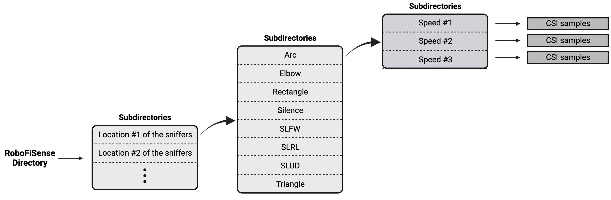
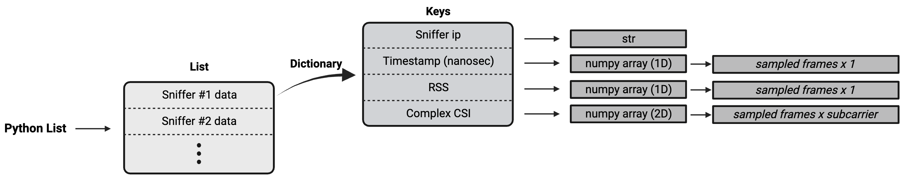

# RoboFiSense
The RoboFiSense is a comprehensive dataset bundle that provides Channel State Information (CSI) in the context of a Franka Emika robotic arm's operations. This dataset offers an extensive range of data pertaining to the various movements executed by the robot. In addition, RoboFiSense provides introductory codes that facilitate the reading and analysis of the dataset. Furthermore, it includes the specific codes utilized in the data extraction process. This resource is designed to support and enhance research and development activities in the field of WiFi sensing and robotics.


<p  align="center"> <b><code style="color : red">The dataset will become available once the "RoboFiSense: Attention-Based Robotic Arm Activity Recognition with WiFi Sensing" gets accepted.</code></b> </p>


https://github.com/SiamiLab/RoboFiSense/assets/22102109/4305f6e2-4143-4499-b160-ef8ffd60b90b


## Dataset Directory
The RoboFiSense dataset is organized in a hierarchical structure, with each location of the sniffers represented by a distinct directory. Within each of these directories, there are eight subdirectories, each corresponding to different movements of the robot. Each movement folder further segregates the data based on the speeds at which the robot arm is moving. Each speed folder encapsulates all the Channel State Information (CSI) samples from the robot. Please refer to the accompanying diagram for a visual representation of this structure.

<p align="center">

</p>

The CSI samples are deeply investigated in the next section.

## Analyzing CSI Samples
Each sample of the dataset contains three files:
 - `.dat` file: This is the raw binary Channel State Information (CSI) data stored in a Python dictionary format in the following format, saved using the *pickle* module. The byte objects contained within this file represent the binary data extracted via the Nexmon project. For additional information, please refer to this [link](http://https://github.com/nexmonster/nexmon_csi/tree/pi-5.10.92#analyzing-the-csi "link").
<p align="center">

</p>

 - `.cmplx` file: This file is a Python list, also saved using the *pickle* module. It decodes crucial information from the .dat file and presents it in a structured format.

<p align="center">

</p>

 - `.jpeg` file: This file represents a plot illustrating the magnitude of the subcarrier values over time. It specifically excludes all unused and pilot subcarriers for clarity and precision.
 
<p align="center">

</p>

</br>

## How to collect CSI data

### Passive Sniffing
To start collecting CSI use the [Nexmon CSI project](http://https://github.com/seemoo-lab/nexmon_csi "Nexmon CSI project") and install it on your device. Here we explain using a Raspberry Pi 4 as the sniffer.

Connect your Raspberry Pi to a router using an **ethernet cable** (the Raspberry will lose the WiFi capability when running the Nexmon project).

Then transfer the `setup.sh` script into the Raspberry Pi and run it using the following command to start collecting the CSI data.

```bash
sudo bash setup.sh --laptop-ip <ip> --raspberry-ip <ip> --mac-adr <MAC> --channel <channel> --bandwidth <bandwidth> --core <core> --spatial-stream <spatial stream>
```

 - The --laptop-ip is the IP of the laptop that wants to collect data, this laptop must be connected to the same router as the raspberry.
 **Note** You can also collect the CSI inside the Raspberry instead of rerouting the packets to another laptop.
 - The --raspberry-ip is the IP of the Raspberry Pi.
 - The --mac-adr is the MAC address of the transmitter you want to filter.
 - --channel, --bandwidth, --core, and --spatial-stream are the CSI collection specifications (read more from Nexmon CSI project)

### CSI Collection
To collect the sniffed CSI data you can use the `tcpdump` command on the Raspberry Pi. if you used the --laptop-ip option in the above command you can also use the `collect_fixedrate_repeated.py` script on your laptop instead of using `tcpdump`.

```bash
python3 collect_fixedrate_repeated.py --frequency <frequency> --packetnum <packetnum>
```

 - --frequency is the frequency you wish to collect the CSI data.
 - --packetnum is the number of packets you wish to collect (you can terminate the process using ctrl+c at any time you wish as well)
 

**NOTE** After the process, the raw CSI data (binary) will be saved into your workspace (read the next section) as a `.dat` file.

**NOTE** the `collect_fixedrate_repeated.py` also can be used using multiple numbers of sniffers, it handles the synchronization and data collection automatically with no changes needed.


### CSI Parsing and Visualization
To parse or visualize the binary data collected in the previous section (`.dat` files), you can use the `binary_to_complex.py` python script.

```bash
python3 binary_to_complex.py --file <filename.dat> --savecomplex --plot --saveplot
```

 - --file specifies the filename.dat generated by the previous section.
 -  --savecomplex saves the collected CSI complex numbers in a `.cmplx` file.
 - --plot shows the plot of the amplitude of the CSI data.
 - --saveplot saves the plot in a jpeg file in your workspace

**NOTE** you can use --folder instead of --file to specify a directory for this script, in this case, the script automatically finds all the `.dat` files inside that directory and process them with respect to --savecomplex and --saveplot options (the --plot won't work when specifying --folder).

## Extract from our License

Any use of the Software that results in an academic publication or
other publication which includes a bibliography must include
citations to the following:

**TODO: To be added**


